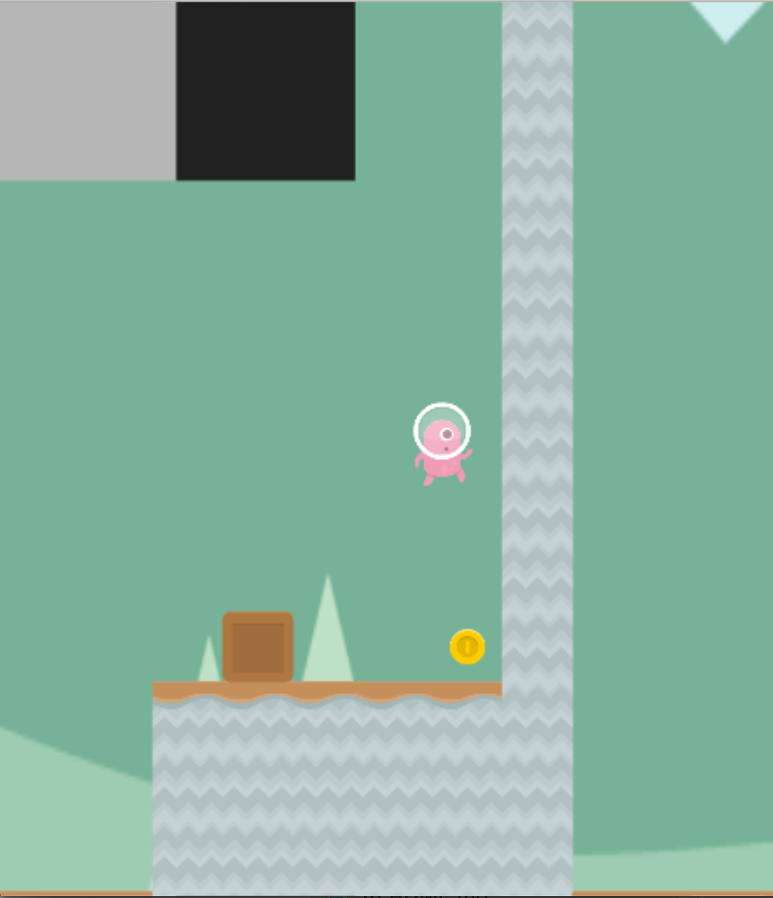
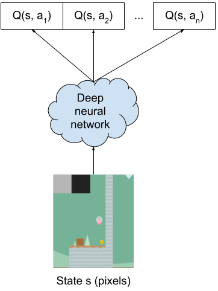
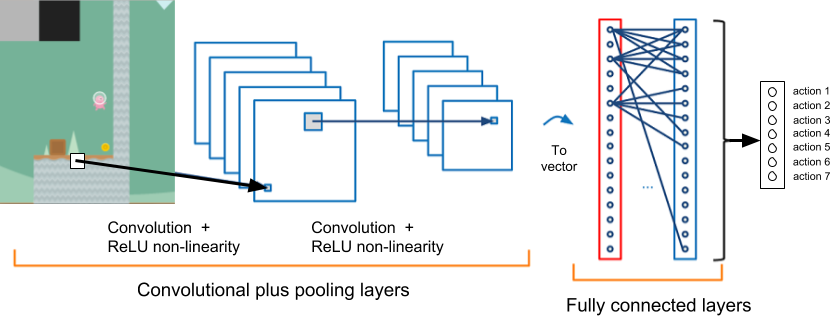
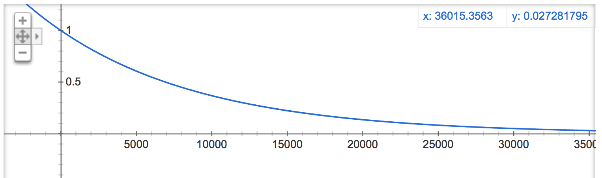

# coinrun-game-ai-assignment


## Introduction 


Computer games are used to benchmark our progress on artificial intelligence. Games are dynamic environments requiring real-time response, problem solving, and sometimes the ability to make strategic decisions several time steps into the future. To make games more like the real world, we further require our algorithms to use vision to process all information from the screen pixels, just like a human, and to also use the same control inputs that humans use (as if using a keyboard).

In the last few years, one particular technique, Deep Reinforcement Learning, has been shown to be able to master many computer games, including most Atari Games, DOTA2, and StarCraft II. Reinforcement Learning (RL) is a class of algorithms that solve a Markov Decision Process. That is, the agent is given:

* *S*: A set of all states the agent could encounter. In the case of computer games, *S* is all configurations of pixels that the game engine can render 
* *A*: A set of all actions. In the case of computer games, this is all keyboard commands.
* *T*: A transition function that indicates the probability of transitioning from one state to another state if a particular action is chosen. We will assume that *T* is unknown.
* *R*: A reward function that computes a score for every state in *S*. In computer games, a reward is given either based on the in-game score, or for finishing a level, or achieveing an objective.

A reinforcement learning agent learns a policy *π(s) = a* that indicates the optimal action a that the agent should take if it is in state s and acts optimally from that point forward in order to acquire the greatest expected reward. To learn the policy, RL agents enact a strategy of trial-and-error learning where the agent tries different actions in different states to see what gets it more reward.

In this assignment, we will be implementing a deep reinforcement learning agent that plays a platform game [CoinRun](https://github.com/openai/coinrun). In CoinRun an agent must walk and jump to collect a coin at the end of the level. There may be monsters that move and kill the agent if touched.



CoinRun was designed to randomly generate levels in order to make it harder for AI systems to learn how to play the game from pixel input. In this assignment, we will fix the levels to a small number of test levels to make the problem easier.

## Deep Reinforcement Learning in a Nutshell

If a simple environment, it is possible to learn a Q-table. A Q-table enumerates all possible states and all possible actions and gives the utility of each action in each state.

States | Action 1 | Action 2 | Action 3 | Action 4 | Action 5 |
--- | --- | --- | --- | --- | --- |
s1 | 0.1 | 0.5 | 0.9 | 0.4 | 0.0 |
s2 | 0.8 | 0.2 | 0.1 | 0.0 | -1.0 |
s3 | 0.0 | 0.0 | 0.0 | 0.0 | 0.0 |
... | ... | ... | ... | ... | ... |

The policy is simply to look up the current state and take the action with the highest Q-value: *π(s) = argmax<sub>a</sub> Q(s, a)*

The challenge with game playing, however, is that the number of possible states--all possible screens--is very large and there is no way an agent could definitely learn the best action for every possible state. One solution is to learn a function that maps states to Q-values.

A Deep Q Network is a neural network that takes a set of pixels representing the screen and predicts the Q value for each action. 



Once this network is trained, one can send any state s (pixels) in and get the Q-values for each of the actions. Once again, the policy is *π(s) = argmax<sub>a</sub> Q(s, a).*

There are two questions we must address:

1. What is the exact structure of the deep Q network (the cloud in the figure above).
2. How to train this Deep Q Network.

## Installation

### Mac and Linux

1. Clone this repository

```git clone https://github.com/markriedl/coinrun-game-ai-assignment.git```

2. Download and install Anaconda.

3. Create anaconda environment with python 3.6

```
conda create -n coinrun python=3
source activate coinrun
```

3. Change into the directory you cloned this repo and install remaining requirements

```pip install -r requirements.txt```

### Windows 10

1. Install Windows Subsystem for Linux

2. Clone this repository

```git clone https://github.com/markriedl/coinrun-game-ai-assignment.git```

3. Download and install Anaconda.

4. Create anaconda environment with python 3.6

```
conda create -n coinrun python=3
source activate coinrun
```

5. Change into the directory you cloned this repo and install remaining requirements

```pip install -r requirements.txt```

### Earlier Windows

Not supported, use Google Colab.

### Testing your installation

In the directory you installed the repository, run an agent that takes random actions:

```python -m coinrun.random_agent```

If you can render graphics, you can also run:

```python -m coinrun.random_render```

and also run the interactive mode:

```python -m coinrun.interactive```

You are now ready to edit main.py to fill in your implementation details.

### Google Colab

You will want to train your agent on a GPU. If you do not have a GPU on your computer, you can use Google's Colab, which provides free GPU access. 

1. Point your browser to [Google Colab](https://colab.research.google.com/)

2. Use File >> Upload notebook to upload coinrun-game-ai-assignment-reward-shaping.ipynb

You will see a bunch of code that is pre-loaded.

3. Turn on GPU support with Edit >> Notebook settings

4. Run the first 8 lines of code by pressing the triangles to the left of each code block.

Instead of editing main.py, you can edit and run the functions directly in the notebook.

## Deep Q Network

A Deep Q Network consists of two parts. The first part is a Convolutional Neural Network (CNN). A Convolutional Neural Network attempts to find features---groups of pixels---that are predictive of whatever output the network is supposed to produce. Roughly, a convolution is a "window" of pixels. Think of a window that slides over the entire screen such that the network is only looking at a tiny set of pixels at a time. The network takes many windows over the full set of pixels and then produces the average network activation for that window. That is, each convolution is boiled down to a single value. Now collect up all those values into a grid and start sweeping a window over that grid to produce an average network activation for the convolution of convolutions. Repeat a number of times until the whole screen is boiled down into a very small number of values.

The result of this process is a vector of numbers. Now run that vector through one or more fully connected neural network layers. The output layer is a vector on *n* numbers where *n* is the number of actions. Let's just pretend that each of these is the utility of the action when the input screen is given.



How can this possibly work? How does it know how much activation for each convolution? That is where backpropagation comes in. Just like ordinary neural networks, we must find the right activation for the right convoluations such that we get the right Q values for each action. More on this later when we talk about training the network.

(Note: one way in which CoinRun is easier than other games is because the horizontal and vertical velocities are given to the agent in the form of visual feedback. In the upper left-hand corner are two gray boxes. The first gray box indicates horizontal velocity. The second gray box indicates vertical velocity. This means the agent doesn't have to infer whether it is rising or falling when jumping. If this information was not present, we would have to collect a buffer of previous screens (typically 2-10).)

### Writing your DQN

In pytorch, we create a neural network by creating a class that inherits from Module. There are two things you must do. In the constructor, you must initialize the layers that will make up your network. You do not have to indicate how the layers connect to each other.

Types of layers that you might find valuable:

* ```nn.Conv2d```: Creates a 2D convoluational layer.
* ```nn.BatchNorm2d```: Makes training more stable. See this [explanation](http://mlexplained.com/2018/01/10/an-intuitive-explanation-of-why-batch-normalization-really-works-normalization-in-deep-learning-part-1/).
* ```nn.ReLU```: a rectified linear unit ```y = x if x >= 0 else 0```
* ```nn.LeakyReLU```: a rectified linear unit that allows a small negative value if the input is less than 0.
* ```nn.Linear```: map a layer of size ```l_in``` to a layer of size ```l_out```. Typically used in conjunction with activation functions such as ReLU, except for the final layer.

```
class DQN(nn.Module):

    ### Create all the nodes in the computation graph.
    ### We won't say how to put the nodes together into a computation graph. That is done
    ### automatically when forward() is called.
    def __init__(self, h, w, num_actions):
        super(DQN, self).__init__()
        self.num_actions = num_actions
        ### WRITE YOUR CODE BELOW HERE

        ### WRITE YOUR CODE ABOVE HERE
 ```

The ```forward()``` function runs the forward pass. You must complete the ```forward()``` function. Pytorch figures out how your layers are connected by how you pass references from each layer into other layers. The input parameter is either a single screen or a batch of screens.

A single screen is passed in during evaluation. It is a 1 x 3 x screen_height x screen_width tensor. (3 is the number of color channels).

During training, GPUs can parallelize inputs into a batch, which is a ```batch_size x 3 x screen_height x screen_width``` tensor. You do not need to create the batches yourself, but your forward function should operate with both single screens (batch size 1) and with full batches.

```
    # Called with either one element to determine next action, or a batch
    # during optimization. Returns tensor([[left0exp,right0exp]...]).
    def forward(self, x):
        q_values = None
        ### WRITE YOUR CODE BELOW HERE

        ### WRITE YOUR CODE ABOVE HERE
        return q_values
```

Your layers should have been set up in the constructor. Pass the inputs ```x``` into the first layer. Pass the outputs of this layer as inputs to the next layer. Repeat until the final layer produces a tensor of shape ```batch_size x num_actions```. These are your Q-values, one for each action.

## DQN Training

We will use a training strategy called *epsilon-greedy*. In epsilon-greedy training, the agent will execute the action given by its policy when a random number [0..1] is greater than *ε* and execute a random action otherwise. That is, sometimes the agent will make a random move just to see what sort of reward it gets. The rest of the time it will do what it's Q approximation function (the neural net) thinks is the action with the best utility for the current state.

But if one thinks about it for a bit, one will realize that the Q approximation function can be quite wrong because it is still being trained. This is okay because during the early stages of training the agent will want to do more random exploration anyway. Over time, the neural net starts to learn to produce Q values that are correct and the agent will start zeroing in on the goal. We aren't ready to train the network just yet, though.

### Prepare Epsilon-Greedy Action Selection

In the below function you will receive:

* state: a 1 x 3 x screen_height x screen_width tensor.
* policy_net: the DQN network
* num_actions: the number of actions in the game
* epsilon: the epsilon value between 0 and 1. Generate a random number. Use the policy network if the random number is greater than epsilon.
* steps_done: the number of steps executed prior to this call.
* bootstrap_threshold: the first few steps the agent execute will not be used to train.

```
def select_action(state, policy_net, num_actions, epsilon, steps_done = 0, bootstrap_threshold = 0):
    action = None
    new_epsilon = epsilon
    ### WRITE YOUR CODE BELOW HERE

    ### WRITE YOUR CODE ABOVE HERE
    return action, new_epsilon
```

The return values are the action selected (a tensor of size 1 x 1, i.e., ```[[action_number]]```), and a new value for epsilon number.

(Hint: when making a new tensor, make sure it gets created in the GPU's memory: ```torch.tensor(some_array, device=DEVICE, dtype=torch.long)```. ```DEVICE``` is a global set to "cuda" if you have a GPU or "cpu" otherwise.)

Epsilon should be decreased slowly, increasing the reliance on the policy and decreasing its randomness. Return the action selected from either the Deep Q Network or from random sampling. If you decrease epsilon, return the new epsilon value as well. Typically, one does not want to decrease epsilon until after the bootstrapping period is over (i.e., ```steps_done > bootstrap_threshold```).

A good schedule for epsilon could be linear in terms of the number of steps or exponential, asymptoting to zero:


### Prepare Replay Memory

There is another problem: catastrophic forgetting. Catastrophic forgetting happens when a neural network adjusts its weights to account for a new input and output pair (recall: a neural network is supervised training so it tries to adjust its weights until it can produce an output that matches the known answer). When the neural network backpropagates and adjusts its weights for one set of input/outputs, it might undo some of the work it did for another set of input/outputs. That is why in standard neural network training one runs the training data set through the network over and over again for many epochs. 

But this is not standard neural network training. We can't just go back and redo all the actions we did in the past. Or can we? We can store all the past memories of states we have seen, actions we chose, new states we transitioned to, and the reward we received. (We still haven't talked about reward yet, but assume that the agent receives some reward after every action). Then after every action we try in the game, we can remind ourselves of some of the things we experienced in the past. This is called "experience replay". Thus every step in the game, we will try an action, receive a reward, and then fondly remember some of the things that happened to us in the past. More specifically, every step of training, we will retrieve some memories and re-run them through our neural network to make sure we haven't catastrophically re-written network weights.

Specifically, we will remember a tuple consisting of:
* state: a 3 x screen_height x screen_width tensor
* action: the number corresponding to an action taken in the above state
* next_state: a 3 x screen_height x screen_width tensor of the state that we saw after taking the action
* reward: the amount of reward we received after taking the action.

```
Transition = namedtuple('Transition',
                        ('state', 'action', 'next_state', 'reward'))
```

The Replay Memory is implemented as a "ring buffer". A ring buffer is just an array that, when it reaches capacity, starts overwriting the beginning of the array. That is, if you have a ring buffer that can contain 100 elements, then the 101st element that gets pushed into the ring buffer overwrites the 0th element, the 102nd element that gets pushed overwrites the 1st element, and so on.

You need to write the push() function in the ReplayMemory. 

```
### Store transitions to use to prevent catastrophic forgetting.
### ReplayMemory implements a ring buffer. Items are placed into memory
###    until memory reaches capacity, and then new items start replacing old items
###    at the beginning of the array. 
### Member variables:
###    capacity: (int) number of transitions that can be stored
###    memory: (array) holds transitions (state, action, next_state, reward)
###    position: (int) index of current location in memory to place the next transition.
class ReplayMemory(object):

    def __init__(self, capacity):
        self.capacity = capacity
        self.memory = []
        self.position = 0

    ### Store a transition in memory.
    ### To implement: put new items at the end of the memory array, unless capacity is reached.
    ###    Combine the arguments into a new Transition object.
    ###    If capacity is reached, start overwriting the beginning of the array.
    ###    Use the position index to keep track of where to put the next item. 
    def push(self, state, action, next_state, reward):
        ### WRITE YOUR CODE BELOW HERE

        ### WRITE YOUR CODE ABOVE HERE

    ### Return a batch of transition objects from memory containing batch_size elements.
    def sample(self, batch_size):
        return random.sample(self.memory, batch_size)

    ### This allows one to call len() on a ReplayMemory object. E.g. len(replay_memory)
    def __len__(self):
        return len(self.memory)
``` 

### Reward and the Q-Update Equation

The reward function is as follows:

* 100 points for touching a coin.

There is nothing you need to do here. The game tells the agent how many points it got after every action performed.

The Deep Q Network outputs Q-values. In a simplified form:

*Q(s<sub>t</sub>, a<sub>t</sub>) = R(s<sub>t+1</sub>) + γ * max<sub>a'</sub>(Q(s<sub>t+1</sub>, a'))*

Specifically, this says that the Q-value for an action *a<sub>t</sub>* performed in state *s<sub>t</sub>* is the reward for being in state *s<sub>t+1</sub>* plus the discounted utility of whatever comes after state *s<sub>t+1</sub>*.

In order to train a deep Q network to predict the Q-value for a state and action pair we are going to need to query the same network for the Q-value of the best action from the successor state and compute the true value of the current state. 

How can we train a neural network if we must use it to figure out the correct answer? This works for the same reason that value iteration works: the original estimates are wrong, but the reward values pull all the numbers closer and closer to their true values until everything converges.

### The Optimizer

Pytorch comes with a number of optimization functions that determine the specifics of how back propagation works. Choose one and set it up in the function below.

Popular choices for optimizer include: ```SGD```, ```Adam```, and ```RMSprop```. 

```
def initializeOptimizer(parameters):
    optimizer = None
    ### WRITE YOUR CODE BELOW HERE
    
    ### WRITE YOUR CODE ABOVE HERE
    return optimizer
```

You may also want to parameterize the learning rate and other parameters for your optimization function instead of using the defaults.

### Optimizing the Neural Network

We finally have all the preliminaries we need to train the neural network. 

We have provided the basic template for DQN training. However, there are a lot of implementation decisions you must make. We have provided separate functions for you to fill in for each implementation detail you must consider.

The code we give you will run the agent for a number of steps to fill up the Replay Memory. After that, the code will run one epoch of training on the neural network after every action the agent takes. But what the network will actually be training on is a randomly selected chunk of Replay Memory.

We need to create a batch, which is a tensor containing multiple transitions that can be run through the GPU in parallel. Grab a chunk of memory of size batch_size from Replay Memory. 

```
def doMakeBatch(replay_memory, batch_size):
    states_batch = None
    actions_batch = None
    next_states_batch = None
    rewards_batch = None
    non_final_mask = None
    ### WRITE YOUR CODE BELOW HERE

    ### WRITE YOUR CODE ABOVE HERE
    return states_batch, actions_batch, next_states_batch, rewards_batch, non_final_mask
```

Return the following:

* *states_batch* is a tensor of size (batch_size x 3 x screen_height, screen_width) containing a batch of screens.
* *actions_batch* is a tensor of size (batch_size x 1) containing a batch of actions (integers). The order of actions should align with the order of states in *states_batch*.
* *rewards_batch* is a tensor of size (batch_size x 1) containing a batch of rewards (floats). The order of actions should align with the order of actions in *actions_batch*.
* *next_states_batch* is a tensor of size (batch_size x 3 x screen_height x screen_width) containing a batch of screens. If a state is terminal then next state is one that is after the simulation ends and thus ```None```.
* *non_final_mask* is a 1-D tensor of length batch_size containing 0 or 1 indicating whether a state in next_states_batch is non-terminal. 1 = non-terminal. 0 = terminal.

(Note: in our codebase, the first dimension of a tensor will often be reserved for batching.)

Now that we have a batch, broken up into a bunch of parts, we need to do a forward pass through the neural network to get the predicted Q-values for each state in the batch. With a GPU each state in the batch can be processed in parallel and produce a tensor containing the predicted utility of each action if it were to be executed in its corresponding state. 

```
def doPredictQValues(policy_net, states_batch, actions_batch):
    state_action_values = None
    ### WRITE YOUR CODE BELOW HERE
    
    ### WRITE YOUR CODE ABOVE HERE
    return state_action_values
```

In pytorch, you run a network by calling it as if it is function, e.g., ```output = reference_to_net(input)```.  This calls the network's forward function automatically.

The return value should be a tensor of size (batch_size x 1) where each element is the Q-value that corresponds to the action in action_batches. For example, if the action in batch[10] is 3, the then ```state_action_values[10]``` should be the fourth Q-value (indexing starts at zero) in the 10th set of Q-values in the returned tensor.

Next we need to know what the neural network thinks the utilities of the *next_states* should be. The utilities of next states after terminal states will be zero. That is, if *state* is terminal, then *next_state* is ```None``` and it's utility is 0. We set up a tensor containing zeros for you. Run only the states in *next_states_batch* that are non_terminal through a forward pass of the network. The *non_final_mask* you computed before tells you which ones are non-terminal. When you are done, you should have a tensor of size (batch_size x 1) containing zero for terminal states and the max Q-value for all other states.

```
def doPredictNextStateUtilities(policy_net, next_states_batch, non_final_mask, batch_size):
    next_state_values = torch.zeros(batch_size, device=DEVICE)
    ### WRITE YOUR CODE BELOW HERE

    ### WRITE YOUR CODE ABOVE HERE
    return next_state_values.detach()
```

(Note: the ```detach()``` at the end of the function just makes sure that the return tensor is not attached of the network's computation graph.)

Next, recall that the Q-value update is the discounted next state values plus reward. Multiply each element in the *next_state_values* tensor by the discount value *γ* and then add each element in the *rewards_batch*.

```
def doComputeExpectedQValues(next_state_values, rewards_batch):
    expected_state_action_values = None
    ### WRITE YOUR CODE BELOW HERE

    ### WRITE YOUR CODE ABOVE HERE
    return expected_state_action_values
```

The return value should be a tensor of size (batch_size x 1) updated Q-values.

Now we are ready to compute the deep Q network's loss. It is recommended that you use pytorch's ```smooth_l1_loss()```. 

```
def doComputeLoss(state_action_values, expected_state_action_values):
    loss = None
    ### WRITE YOUR CODE BELOW HERE

    ### WRITE YOUR CODE ABOVE HERE
    return loss
```

Once you have the loss for each sample in the batch, you are ready to do backpropogation. Pytorch remembers the steps that were involved in computing the loss variable in it's computation graph, including every weight activation that occured during the forward pass. Simply call ```loss.backward()```.

```
def doBackprop(loss, parameters):
    ### WRITE YOUR CODE BELOW HERE

    ### WRITE YOUR CODE ABOVE HERE
```

There is one complication: ReLU activation functions can result in run-away gradients. Make sure that each parameter passed in is between -1 and 1. Hint: gradient data is stored in a tensor's ```.grad``` member. See also ```clamp_()```.


### Other Stuff

The following function pre-processes the screen. It prepares the screen as a tensor. We provide the necessary screen preparation. You may perform additional screen manipulations, though it probably isn't necessary.

```
### Take the environment and return a tensor containing screen data as a 3D tensor containing (color, height, width) information.
### Optional: the screen may be manipulated, for example, it could be cropped
def get_screen(env):
    # Returned screen requested by gym is 512x512x3. Transpose it into torch order (Color, Height, Width).
    screen = env.render(mode='rgb_array').transpose((2, 0, 1))
    _, screen_height, screen_width = screen.shape
    ### DO ANY SCREEN MANIPULATIONS NECESSARY (IF ANY)

    ### END SCREEN MANIPULATIONS
    # Convert to float, rescale, convert to torch tensor
    # (this doesn't require a copy)
    screen = np.ascontiguousarray(screen, dtype=np.float32) / 255
    screen = torch.from_numpy(screen)
    # Resize, and add a batch dimension (BCHW)
    return resize(screen).unsqueeze(0).to(DEVICE)
```

## Running the Training Code

There are some parameters that you can set:

* ```NUM_EPISODES```: How many training episodes. An episode is one game, either timing out or succeding when the coin is touched.
* ```EVAL_INTERVAL```: How many episodes to run before evaluating the network.
* ```REPLAY_CAPACITY```: How big is the experience replay ring buffer.
* ```BATCH_SIZE```: how many experiences can be run in parallel during training
* ```GAMMA```: How much to discount Q-values
* ```BOOTSTRAP```: How many screens to collect and put in replay memory before training starts.
* ```EPSILON```: probability of taking a random action.

```
NUM_EPISODES = 1000
EVAL_INTERVAL = 10
REPLAY_CAPACITY = 10000
BATCH_SIZE = 128
GAMMA = 0.999
BOOTSTRAP = 10000
EVAL_EPSILON = 0.1
EPSILON = 0.9
```

From the command line:

* ```python main.py --render --save saved.model``` or ```python main.py --save saved.model```

From Google Colab:

* Run all blocks in order, finishing in the block that calls ```train()```.

Here is what you will see when the code starts running:

```
Making new model.
training...
episode: 0 epsilon: 0.9
duration: 465
max reward: [100.]
total steps: 465
episode: 0 epsilon: 0.9
duration: 256
max reward: [100.]
total steps: 721
episode: 0 epsilon: 0.9
duration: 113
max reward: [100.]
total steps: 834
episode: 0 epsilon: 0.9
duration: 698
max reward: [100.]
total steps: 1532
episode: 0 epsilon: 0.9
duration: 408
max reward: [100.]
total steps: 1940
episode: 0 epsilon: 0.9
duration: 1002
max reward: [0.]
total steps: 2942
...
```

Each episode is printed. An episode is a complete play of the game, concluding either in the game timing out our the agent reaching the coin. Initially, the agent is in "bootstrapping" mode. It is acting randomly until it has collected the designated number of screens in the ```BOOTSTRAP``` variable. While bootstrapping, episode 0 repeats over and over. This is not a bug.

Each episode reports:
* duration: how many actions executed before the game ends.
* max reward: the greatest amount of reward achieved during the game after any one action.
* total steps: this is the cummulative number of actions performed across *all* episodes/games.

If graphics are being rendered, you will see the agent move very fast during bootstrapping and then slow down after bootstrapping because the neural network is being trained after every frame update.

As a rule of thumb, you will see a duration of > 1000 if the agent never achieves the coin and the game times out. When duration > 1000, you will also see a max reward of 0. A purely random agent will often reach the coin, but when the agent is highly random, the duration times will be 100 or greater. Don't get too excited until you start seeing durations of fewer than 60, with durations of around 20 being close to optimal.

Every ```EVAL_INTERVAL``` episodes, the current deep Q network will be evaluated. Evaluation means the epsilon is set to a very low exploration probability and the game is run 10 times in a row without any learning. It looks like this:

```
Evaluating...
duration: 164
max reward: [100.]
Evaluating...
duration: 62
max reward: [100.]

...

Average duration: 53.7
Average max reward: [100.]
evaluation window: [53.7 946.3 20.6 128.8 1002.0] window average: 430.28
```

During evaluation, we keep a rolling window of the last five evaluation periods. If the average duration of the evaluation window reduces, we save the model to disk. 

## Running the Testing Code

From the command line:

* ```python main.py --render --eval --load saved.model``` or ```python main.py --eval --load saved.model```

From Google Colab:

* Run all blocks in order, finishing in the block that calls ```evaluate()```.

Evaluation outputs are as above.

If you are training on Colab or on a machine with a GPU but no screen, you may want to run the evaluation on your personal machine and render the outputs. You can download the model file to your personal machine and run it. However, if the model was trained with a GPU and you want to run the model on a machine without a GPU, you will run into problems. You first need to covert the model from one that runs on a GPU to one that runs only on a CPU. On the machine with the GPU, run ```cuda_to_cpu --infile saved.model --outfile saved_cpu.model```. You can download this new file and run it on a CPU-only machine. (There is a corresponding cell block in Colab.)

## Notes on Debugging

**pdb**

pdb is a python debuggin tool that runs from the command line or Colab notebooks. Use ```pdb.set_trace()``` to create a break-point with a prompt. Print variables and inspect their values to get a sense of what is going on.

**Tensors and their shapes**

Tensors can be thought of as multi-dimensional arrays of input or output data for the neural network. They operate very much like regular python arrays and support indexing.

Be mindful that your data is in tensors of the correct shapes. A good thing to do is use *pdb* to interrupt execution and check whether your tensor shapes are correct. Use ```tensor.size()``` to inspect a tensor's shape.

Sometimes you will need to create new tensors from scratch. Here is a quick cheatsheet:

* ```torch.zeros(dim_1, dim_2, ..., dim_n)``` --- This creates an *n*-dimensional tensor filled with zeros.
* ```torch.ones(dim_1, dim_2, ..., dim_n)``` --- This creates an *n*-dimensional tensor filled with ones.
* ```torch.tensor(array)``` --- This creates a tensor of the same dimensions as a regular python array. For example ```array = [1, 2, 3]``` will create a 1-D tensor, ```array = [[11, 12, 13], [21, 22, 23], [31, 32, 33]]``` will create a 2-D tensor of shape 3 x 3, etc.

It is generally a good idea to indicate whether a tensor lives on the CPU or the GPU. The ```DEVICE``` global is set to ```"cuda"``` if a GPU is available or set to ```"cpu"``` otherwise. When you create a tensor you can indicate where it lives: ```torch.zeros(10, device="cuda")``` or ```torch.zeros(10, device="cpu")``` or ```torch.zeros(10, device=DEVICE)```. You can move tensors from CPU to GPU or vice versa by using ```tensor.to()```.

When creating a tensor you might also want to specify the type of data that is being stored. For example:
* ```torch.zeros(10, dtype=torch.uint8)``` creates a tensor of bytes.
* ```torch.zeros(10, dtype=torch.long)``` creates a tensor of longs.
* ```torch.zeros(10, dtype=torch.float)``` creates a tensor of floats.

**Unit tests**

We provide a utility for unit testing many of the functions you have to complete.

To run the unit-tests from the command line:

```python main.py --unit_test```

To run the unit_tests in Colab, look for the cell that calls ```unit_test()```.

**How to interpret training and testing results**

A duration of greater 1000 or more means that the agent was unable to reach the coin. A duration of greater than 100 means the agent relies a lot on randomness and luck. A well-trained agent should be able to reach the coin in under 40 steps and probably clsoer to 20.

You will see the agent's duration fluctuate a lot from episode to episode. Early on this is because ε is high and the agent is very random. The performance of the agent during training doesn't have a lot of predictive power about how the agent will perform during the next evaluation because ε is set very low (0.1 or less).

We do not set ε=0 for testing, which allows for a small amount of randomness during testing. Without randomness, the agent's model would need to be very close to perfect or it will fail to reach the coin. For example, the agent may have learned to crouch or have failed to learn to jump up a ledge, in which case it agent will get stuck. A small amount of randomness means that the agent will occasionally make a move that may get it unstuck by transitioning the agent into a state in which it does know the right thing to do. If the agent relies too much on the randomness to make progress, we will see high durations. If the agent's policy is good the agent will make faster, and more steady progress resulting in lower durations even with some randomness.


## Grading

* 2 point: pass unit tests
* 4 points: Train a network that can beat the easy level in less than 150 duration (averaged over 10 runs, with evaluation epsilon 0.1)
* 1 point: Train a network that can beat the easy level in less than 100 duration (averaged over 10 runs, with evaluation epsilon 0.1)
* 1 point: Train a network that can beat the easy level in less than 50 duration (averaged over 10 runs, with evaluation epsilon 0.1)
* 1 point: Train a network that can beat the easy monster level in less than 150 duration (averaged over 10 runs, with evaluation epsilon 0.1)
* 1 point: Train a network that can beat the medium level in less than 150 duration (averaged over 10 runs, with evaluation epsilon 0.1)